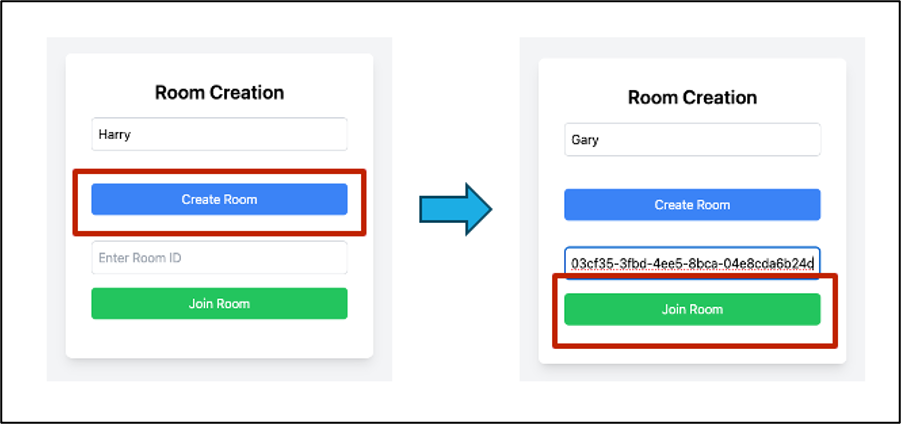
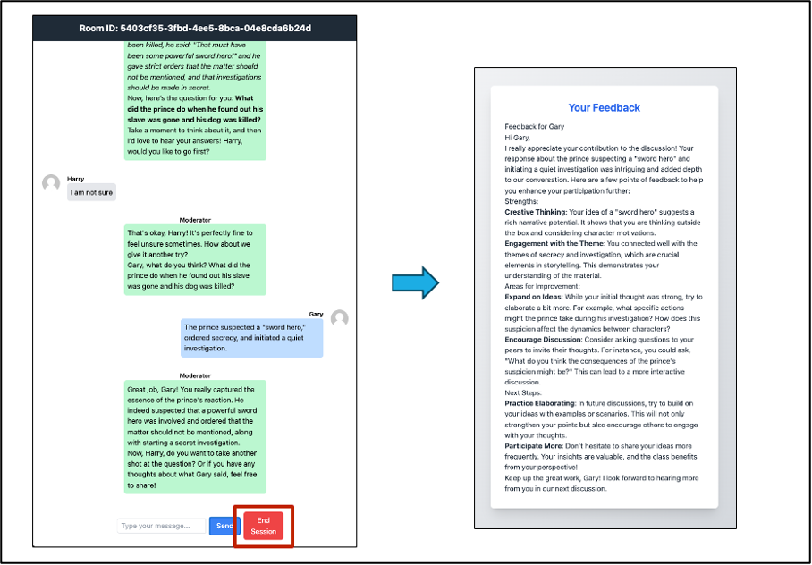

# Collaborative Learning with LLMs

  
*Figure 1: Room Creation Interface.*

  
*Figure 2: Main Workflow of the Collaborative Learning Platform.*

This project showcases a **Collaborative Learning Platform powered by Large Language Models (LLMs)**, enabling students to engage in interactive, AI-moderated learning sessions. By leveraging Retrieval-Augmented Generation (RAG) and a minimalist design philosophy, the platform provides an effective, scalable, and engaging educational experience.

---

## Features

1. **Dataset-Driven Learning**:
   - Uses the **FairytaleQA** dataset for content delivery, comprising 10,580 questions (explicit and implicit) based on 278 child-friendly stories.
   - Dataset selection aligns with pedagogical goals such as critical thinking, narrative understanding, and language development.

2. **AI-Moderated Discussions**:
   - Powered by **GPT-4o-mini**, the AI moderator facilitates discussions, retrieves learning material, poses questions, and provides hints in real-time.
   - Adaptive moderation ensures content remains engaging and appropriately challenging for students.

3. **Room Creation and Dynamic Grouping**:
   - Virtual rooms allow students to initiate collaborative learning sessions.
   - Groups are automatically formed, with discussion sessions starting once the room reaches capacity.

4. **Equitable Participation**:
   - The AI moderator promotes balanced contributions through turn-taking and directed questions.

5. **Personalized Feedback**:
   - Each session concludes with feedback highlighting individual strengths and areas for improvement, encouraging reflective learning.

6. **Dataset-Agnostic Design**:
   - Supports integration with various QA datasets, enabling customization for diverse subjects and educational contexts.

7. **Minimalist and User-Friendly Design**:
   - A simple, intuitive interface ensures focus on learning activities rather than navigation.

---

## System Architecture

The platform integrates modern web development frameworks and AI tools for scalability, efficiency, and user engagement:

- **Backend**: Implemented in Python using Flask for API endpoints and Socket.IO for real-time communication.
- **Frontend**: Built with React, featuring a responsive and component-based architecture.
- **AI Integration**: 
  - Moderation and feedback powered by **GPT-4o-mini**.
  - Uses LangChain for prompt management and conversational state.
- **Retrieval-Augmented Generation (RAG)**:
  - Dynamically retrieves passages and Q&A pairs to support discussions.
  - Can adapt to new datasets with minimal changes.

---

## Setup Instructions

### 1. Start the Backend Server

1. Navigate to the server directory:
   ```bash
   cd ./server
   ```

2. Install required dependencies:
   ```bash
   pip install -r requirements.txt
   ```

3. Start the server:
   ```bash
   python app.py
   ```

---

### 2. Run the Frontend

1. Navigate to the client frontend directory:
   ```bash
   cd ./client/frontend
   ```

2. Install dependencies:
   ```bash
   npm install
   ```

3. Start the frontend:
   ```bash
   npm start
   ```

---

### 3. Simulate Multiple Clients

- Open multiple instances of the frontend to simulate multiple students in a collaborative learning session.
- Each client represents a unique student.

---

## Workflow

1. **Room Creation**:
   - Students create rooms using unique meeting IDs.
2. **Session Start**:
   - AI moderator begins when the room reaches its capacity.
3. **Learning Interaction**:
   - Passages and questions are presented; students discuss and respond.
4. **Feedback**:
   - Session concludes with personalized feedback for each participant.

---

## Contributions

We welcome contributions to improve and extend the platform! Follow these steps:

1. Fork the repository.
2. Create a new branch:
   ```bash
   git checkout -b feature-name
   ```
3. Make your changes and push to your fork.
4. Submit a pull request for review.

---

## License

This project is licensed under the MIT License. See the `LICENSE` file for more details.

---

## Acknowledgments

This platform leverages **FairytaleQA**, **GPT-4o-mini**, and cutting-edge web technologies to deliver an engaging educational experience. Special thanks to the open-source community for enabling this development.
__________________________________________________________


# LLM Moderator - Project Documentation

## Project Overview

**LLM Moderator** is a **Collaborative Learning Platform** powered by Large Language Models (LLMs). It enables students to engage in interactive, AI-moderated learning sessions where an AI moderator guides discussions, presents educational content, and provides personalized feedback.

### Project Type
This is a **full-stack web application** with:
- **Backend**: Python Flask server with Socket.IO for real-time communication
- **Frontend**: React-based single-page application (SPA)
- **AI Integration**: OpenAI GPT-4o-mini for moderation and content generation
- **Architecture**: Real-time, event-driven system using WebSockets

### What It Does

The platform facilitates collaborative learning through:

1. **AI-Moderated Story Discussions**: Students join virtual rooms and participate in story-based learning sessions moderated by an AI
2. **Two Moderation Modes**:
   - **Active Mode**: AI actively moderates, asks questions, and advances the story based on student participation
   - **Passive Mode**: Story progresses automatically at intervals, with minimal AI intervention
3. **Real-Time Collaboration**: Multiple students can join the same room and interact simultaneously
4. **Personalized Feedback**: At the end of sessions, students receive individualized feedback on their participation
5. **Speech Support**: Text-to-Speech (TTS) and Speech-to-Text (STT) capabilities for audio interactions

---

## Project Structure

### Root Directory (`/`)

The root contains:
- **README.md**: Project overview and basic setup instructions
- **LICENSE**: MIT License file
- **.gitignore**: Git ignore patterns
- **package-lock.json**: Root-level npm lock file (minimal)
- **screenshot_1.png** & **screenshot_2.png**: UI screenshots
- **docs.md**: This comprehensive documentation file

---

### `/server` - Backend Server

**Purpose**: Python Flask backend that handles all server-side logic, AI integration, and real-time communication.

#### Key Files:

- **`app.py`** (Main Server File)
  - Flask application with Socket.IO integration
  - Handles room creation, joining, and message routing
  - Manages real-time WebSocket connections
  - Implements TTS/STT endpoints (`/tts`, `/stt`)
  - Contains `Room` class for managing learning sessions
  - Implements silence monitoring and story progression logic

- **`chatbot.py`**
  - Wrapper class for OpenAI API interactions
  - Handles retry logic and error fallbacks
  - Manages prompt truncation for token limits
  - Provides fallback responses when API is unavailable

- **`data_retriever.py`**
  - Unified story loading system
  - Loads stories from cached JSON files or generates new ones
  - Manages story cache directory (`/stories`)
  - Provides story formatting and intro generation
  - Falls back to default story if generation fails

- **`prompts.py`**
  - Contains all AI prompt templates for moderation
  - Defines system prompts for active and passive modes
  - Handles LLM initialization (LangChain + OpenAI)
  - Generates moderator replies, nudges, and feedback
  - Classifies student responses semantically

- **`story_constructor.py`**
  - Generates new stories using GPT from FairytaleQA dataset
  - Loads FairytaleQA dataset using HuggingFace `datasets`
  - Reorders story fragments into coherent narratives
  - Saves generated stories to JSON cache

- **`requirements.txt`**
  - Python dependencies including:
    - Flask, Flask-SocketIO, Flask-CORS
    - OpenAI, LangChain
    - Pandas, datasets (HuggingFace)
    - pydub (audio processing)
    - Other utilities

#### Subdirectories:

- **`/stories/`**: Cached story JSON files
  - Contains pre-generated stories like `golden-goose.json`, `jelly-fish-and-monkey.json`, etc.
  - Stories are saved here after generation for reuse

- **`/testing_notebooks/`**: Development and testing notebooks
  - Jupyter notebooks for testing and experimentation
  - Contains test code and debugging utilities

#### Log Files:
- `server_debug.log`: Server-wide debug logs
- `room-*.log`: Per-room activity logs (one per room session)

---

### `/client` - Frontend Application

**Purpose**: React-based frontend that provides the user interface for students to interact with the learning platform.

#### Structure:

- **`/client/frontend/`**: Main React application

  - **`package.json`**: Frontend dependencies
    - React, React Router DOM
    - Socket.IO Client
    - Framer Motion (animations)
    - React Markdown (for rendering AI messages)
    - Tailwind CSS (styling)

  - **`/src/`**: Source code
    - **`App.js`**: Main application component with routing
    - **`index.js`**: React entry point
    - **`socket.js`**: Socket.IO client configuration
    - **`/components/`**: React components
      - **`RoomCreation.js`**: Component for creating/joining rooms
      - **`ChatRoom.js`**: Main chat interface with real-time messaging
      - **`FeedbackPage.js`**: Displays personalized feedback after sessions

  - **`/public/`**: Static assets
    - HTML template, favicons, manifest files

  - **`tailwind.config.js`**: Tailwind CSS configuration

---

### `/venv` - Python Virtual Environment

**Purpose**: Isolated Python environment containing all installed dependencies.

- Contains Python packages installed via `pip install -r requirements.txt`
- Should be activated before running the server
- Not typically committed to version control (in `.gitignore`)

---

### `/.idea` - IDE Configuration

**Purpose**: IntelliJ IDEA / PyCharm project settings (if using JetBrains IDEs).

- IDE-specific configuration files
- Not essential for project functionality

---

## How to Run the Project

### Prerequisites

1. **Python 3.11+** installed
2. **Node.js 16+** and **npm** installed
3. **OpenAI API Key** (required for AI features)
4. **FFmpeg** (for audio processing - TTS/STT features)
   - Note: The code currently has a hardcoded Windows path; you may need to adjust this for macOS/Linux

### Step 1: Environment Setup

1. **Create a `.env` file** in the `/server` directory with the following variables:

```env
# OpenAI Configuration
OPENAI_API_KEY=your_openai_api_key_here
OPENAI_CHAT_MODEL=gpt-4o-mini
OPENAI_TEMPERATURE=0.3
OPENAI_MAX_TOKENS=1500

# Moderation Modes
ACTIVE_MODE=active
PASSIVE_MODE=passive

# Story Progression
ACTIVE_STORY_STEP=1
PASSIVE_STORY_STEP=1

# Silence/Intervention Windows (seconds)
ACTIVE_SILENCE_SECONDS=20
PASSIVE_SILENCE_SECONDS=10
ACTIVE_INTERVENTION_WINDOW_SECONDS=20
PASSIVE_INTERVENTION_WINDOW_SECONDS=10

# Story Chunk Interval (seconds)
STORY_CHUNK_INTERVAL=10

# Chat History Limit
CHAT_HISTORY_LIMIT=50

# Messages
WELCOME_MESSAGE=Welcome everyone! I'm the Moderator.
ACTIVE_ENDING_MESSAGE=✨ We have reached the end of the story.
PASSIVE_ENDING_MESSAGE=✨ We have reached the end of the story.

# Ending Styles
ACTIVE_ENDING_STYLE=warm
PASSIVE_ENDING_STYLE=warm
```

### Step 2: Backend Setup

1. **Navigate to the server directory**:
   ```bash
   cd server
   ```

2. **Create and activate a virtual environment** (if not already created):
   ```bash
   # On macOS/Linux
   python3 -m venv venv
   source venv/bin/activate
   
   # On Windows
   python -m venv venv
   venv\Scripts\activate
   ```

3. **Install Python dependencies**:
   ```bash
   pip install -r requirements.txt
   ```

4. **Note on FFmpeg** (for audio features):
   - The code in `app.py` has a hardcoded Windows FFmpeg path
   - For macOS/Linux, you may need to:
     - Install FFmpeg: `brew install ffmpeg` (macOS) or `sudo apt-get install ffmpeg` (Linux)
     - Comment out or modify lines 77-83 in `app.py` to use system FFmpeg

5. **Start the backend server**:
   ```bash
   python app.py
   ```
   
   The server will start on `http://0.0.0.0:5000` (or `http://localhost:5000`)

### Step 3: Frontend Setup

1. **Open a new terminal** and navigate to the frontend directory:
   ```bash
   cd client/frontend
   ```

2. **Install Node.js dependencies**:
   ```bash
   npm install
   ```

3. **Start the React development server**:
   ```bash
   npm start
   ```
   
   The frontend will start on `http://localhost:3000` (default React port)

### Step 4: Using the Application

1. **Open your browser** and navigate to `http://localhost:3000`

2. **Create a Room**:
   - Enter your name
   - Choose moderation mode (Active or Passive)
   - Click "Create Room"
   - Copy the room ID to share with other students

3. **Join a Room** (in another browser tab/window to simulate multiple students):
   - Enter your name
   - Enter the room ID
   - Click "Join Room"

4. **Participate in the Session**:
   - Once 2+ students join, the story begins
   - Chat with other students and the AI moderator
   - Use voice input (microphone button) for speech-to-text
   - Listen to AI responses with text-to-speech

5. **View Feedback**:
   - After the story ends, you'll be redirected to a feedback page
   - Review personalized feedback on your participation

---

## Key Features Explained

### Active Mode
- AI moderator actively engages students
- Story advances based on student participation and silence detection
- More interactive, with AI asking questions and providing hints
- Story progresses when students are silent for a configured duration

### Passive Mode
- Story progresses automatically at fixed intervals
- Minimal AI intervention
- Students can discuss freely while the story unfolds
- More self-directed learning experience

### Real-Time Communication
- Uses Socket.IO for bidirectional WebSocket communication
- Messages are broadcast to all participants in a room
- Chat history is maintained and sent to new joiners

### Story Management
- Stories are generated from FairytaleQA dataset or loaded from cache
- Stories are broken into sentences and presented incrementally
- Supports multiple stories stored as JSON files

### Audio Features
- **Text-to-Speech (TTS)**: Converts AI moderator messages to speech
- **Speech-to-Text (STT)**: Converts student voice input to text
- Uses OpenAI's audio API models

---

## Troubleshooting

### Backend Issues

1. **Port 5000 already in use**:
   - Change the port in `app.py` (last line): `socketio.run(app, host="0.0.0.0", port=5001)`
   - Update frontend socket connection in `client/frontend/src/socket.js`

2. **FFmpeg errors**:
   - Install FFmpeg system-wide or adjust paths in `app.py`
   - Audio features may not work without FFmpeg

3. **OpenAI API errors**:
   - Verify your API key in `.env`
   - Check API quota and billing
   - Review error logs in `server_debug.log`

4. **Import errors**:
   - Ensure virtual environment is activated
   - Reinstall dependencies: `pip install -r requirements.txt`

### Frontend Issues

1. **Cannot connect to server**:
   - Verify backend is running on port 5000
   - Check CORS settings in `app.py`
   - Verify socket connection URL in `socket.js`

2. **npm install fails**:
   - Clear cache: `npm cache clean --force`
   - Delete `node_modules` and `package-lock.json`, then reinstall

3. **Port 3000 already in use**:
   - React will prompt to use another port
   - Or set port: `PORT=3001 npm start`

---

## Development Notes

- **Logging**: Extensive debug logging is enabled. Check `server_debug.log` and room-specific logs for debugging
- **Story Caching**: Stories are cached in `/server/stories/` to avoid regenerating
- **Room Management**: Rooms are stored in memory (not persisted). Restarting the server clears all rooms
- **Testing**: Use multiple browser tabs/windows to simulate multiple students

---

## Additional Resources

- **FairytaleQA Dataset**: [HuggingFace](https://huggingface.co/datasets/GEM/FairytaleQA)
- **Flask-SocketIO Documentation**: [Flask-SocketIO Docs](https://flask-socketio.readthedocs.io/)
- **React Documentation**: [React Docs](https://react.dev/)
- **OpenAI API Documentation**: [OpenAI Docs](https://platform.openai.com/docs)

---

## License

This project is licensed under the MIT License. See the `LICENSE` file for details.
